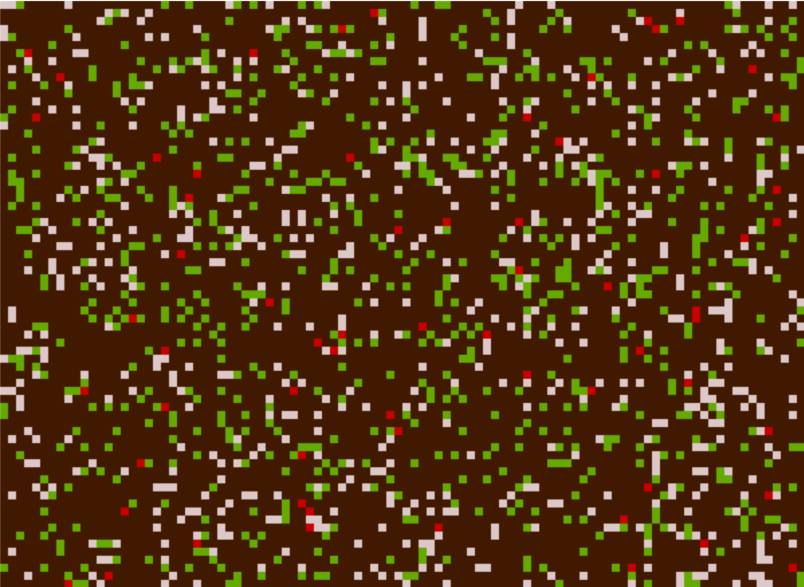
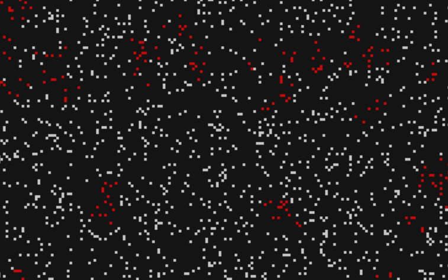
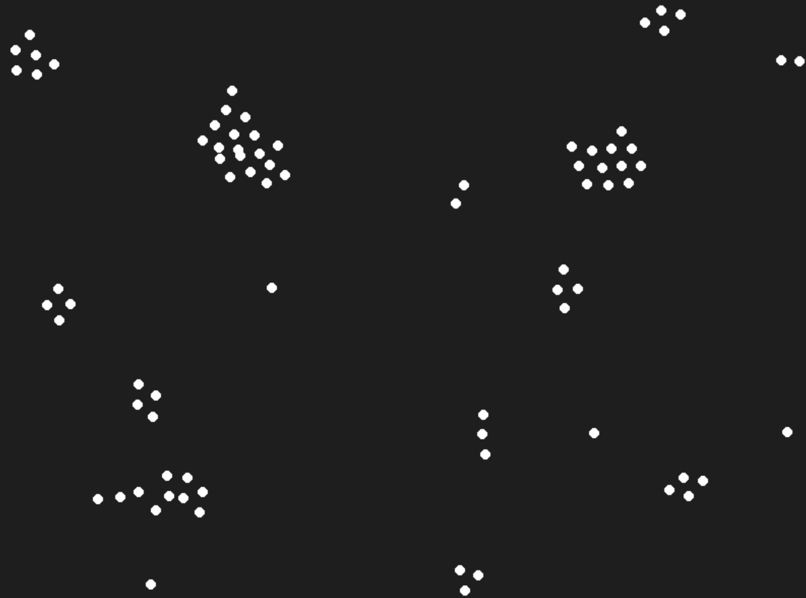
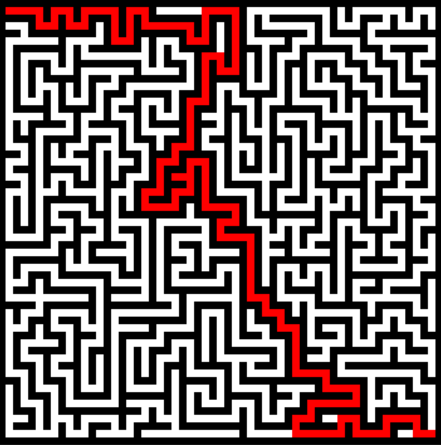
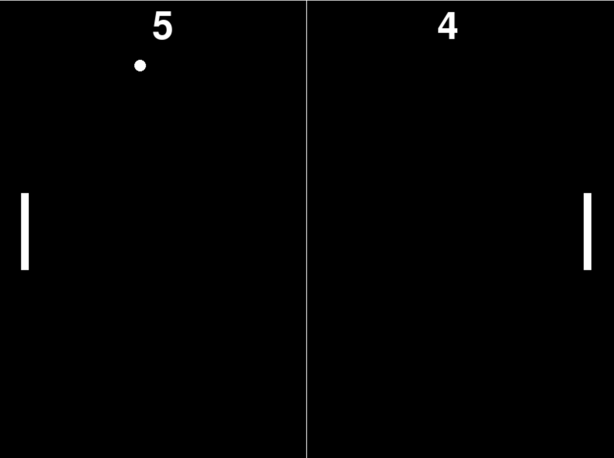
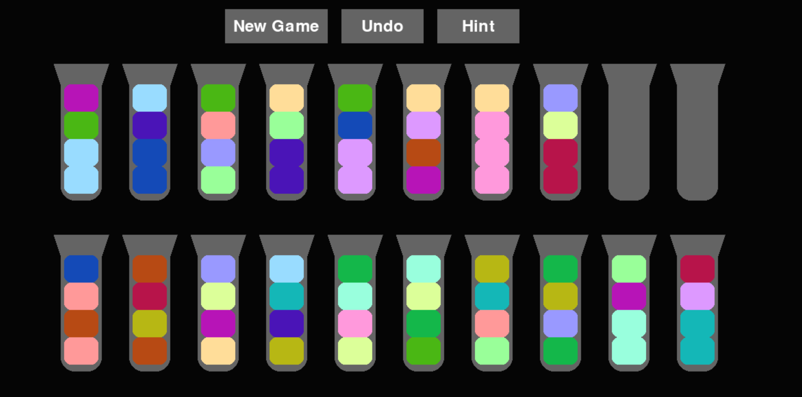

# Python Fun

Welcome to **Python Fun**, a collection of various Python scripts created for experimentation and learning. Each script
is an independent project that showcases different algorithms and simulations, often inspired by real-world phenomena or
popular games.

---

### Requirements

- pygame

### How to Run

1. **Clone the repository:**
   ```bash
   git clone https://github.com/wojzam/python-fun.git
   cd python-fun
    ```
2. **Install dependencies:** (pygame)
   ```bash
   pip install pygame
    ```
3. **Run a script:** Navigate to the script of your choice and run it using Python. For example:
   ```bash
   python predandprey.py
    ```

## Project Overview

This repository contains the following small Python projects:

### 1. Predator and Prey Simulation (`predandprey.py`)

This script simulates an ecosystem where predators and prey interact in a grid. The simulation is based on a simplified
biological model where predators hunt the prey, and both species reproduce at certain rates. Over time, population
dynamics and survival strategies can emerge. Press 'Enter' to run/stop simulation, 'Space' to perform one step and 'p'
to
plot population changes.

<p>
  
</p>

### 2. SIR Model Simulation (`sir.py`)

This script simulates the spread of an infectious disease using the classic SIR (Susceptible, Infected, Recovered)
epidemiological model. You can adjust infection rates and recovery probabilities to see how the disease spreads over
time, and how measures like immunity or social distancing might influence the outcome. Press 'Enter' to run/stop
simulation.

<p>
  
</p>

---

### 3. Boids Flocking Simulation (`boids.py`)

This project is a simulation of flocking behavior based on Craig Reynolds' Boids algorithm. Each "boid" follows simple
rules for cohesion, alignment, and separation to mimic the behavior seen in flocks of birds or schools of fish. Watch as
they form complex and seemingly intelligent group movements.

<p>
  
</p>

### 4. Maze Generator and Solver (`maze.py`)

This script generates random mazes and then solves them using pathfinding algorithms like Depth-First Search (DFS).
It's a fun demonstration of how maze generation and solving techniques work. Press 'Enter' to generate new maze and '
Space' to find path.

<p>
  
</p>

---

### 5. Pong Game (`pong.py`)

Relive the classic Pong game! This script is a simple recreation of the famous arcade game, where two players compete to
hit a ball back and forth using paddles. It's a great exercise in basic game mechanics and real-time event handling.

<p>
  
</p>

### 6. Fluid Sort Game (`bottles.py`)

A Python implementation of the popular fluid sorting puzzle. The goal is to sort different colored liquids.
This game challenges your logic and problem-solving skills as you carefully plan each move to
sort the liquids efficiently.

<p>
  
</p>                                 